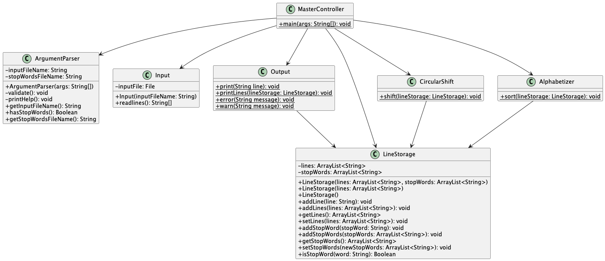

# SE 211 Assignment #1

## Requirements

- [x] Read lines from a file
- [x] Optionally specify a file of stop words to ignore
- [x] Parse arguments from the command line. Accept a file and an optional stop word file (`-s`).
- [x] Errors
  - [x] `Error: The file inputfile does not exist`
  - [x] `Error: The file inputfile is empty`
- [x] Warnings
  - [x] `Warning: The file stopwords does not exist`
  - [x] `Warning: The file stopwords is empty`
- [x] Output like slides

## UML

