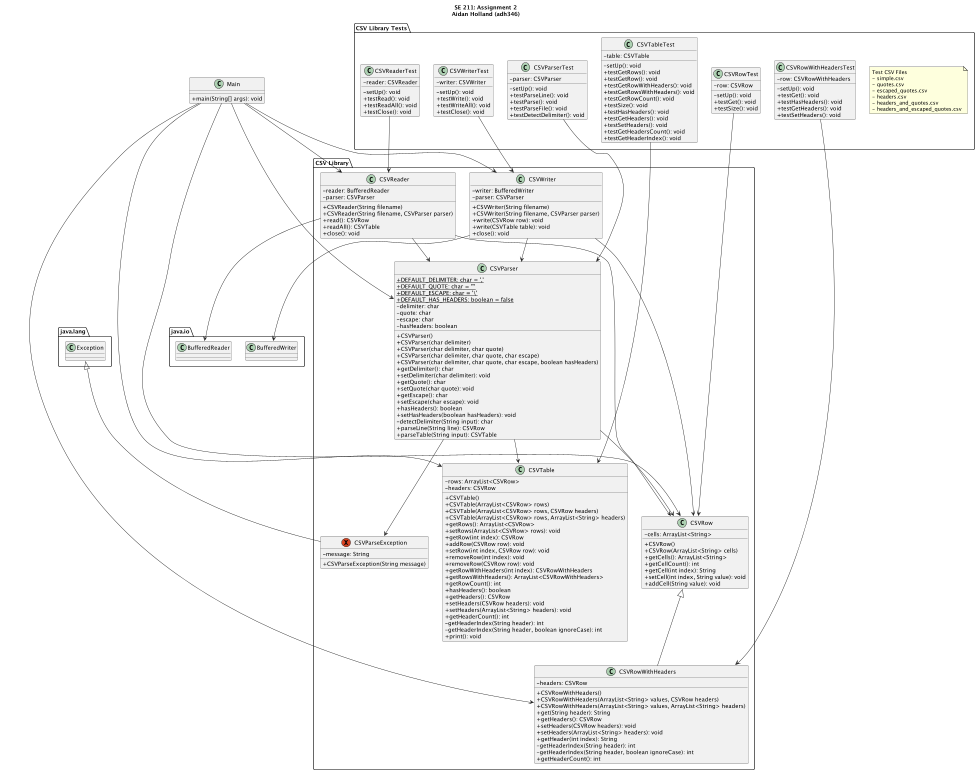

# SE 211 Assignment #2

## Description

Your assignment is to design and implement a library to handle CSV files. This
library should be designed so that it is worthy of general use. As part of
this assignment, you need to come up with the specification of the
requirements for the proposed library. These requirements should address
issues related to the format of the CSV file, the interface provided by the
library, and error recovery.

## Requirement Specifications

See [REQUIREMENTS.md](REQUIREMENTS.md).

## UML

## Test UI

The test UI is a simple Java Swing application that allows you to test the
CSV library. It is located in the `src/edu/drexel/se211/CSVLibTestUI` folder.

### Usage

1. Open the project in IntelliJ.
2. Run the `edu.drexel.se211.Main` class.
3. Select a CSV file to open.

## Known Issues

- Adding Rows from the Test UI will only add them to the bottom of the table.
- Sometimes clicks are handled twice, causing a visual glitch.
