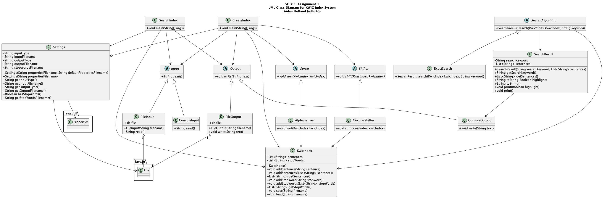

# SE 311 - Assignment 1

## Overview

### User Scenarios

1. Create a sentence repo: The user can enter a list of sentences, in the form of a .txt file, or from the console, configurable by the user. The system will circularly shift each sentence by repeatedly removing the first word and appending it at the end of the line. The system will then output a list of all circular shifts of all lines in alphabetical order, in the form of a new txt file, or to the console, configurable by the user.
2. Keyword search: The user enters a keyword; the system will return all the sentences containing the keyword in the sentence repository in the console, and the keyword will be highlighted. If the keyword is not contained in any sentences previously entered, the system will return ``[keyword] not found.”
3. Formatted search output: The user can configure the system to determine if a header, a footer, or both should be added. The header will display “[X] results are found in [Y] records' ', and the footer will display time and date of the search.

### UML Class Diagram

## Getting Started

### Prerequisites

- Java 14
- IntelliJ IDEA

### Configuration

Configuration is done in the `./resources/settings.properties` file. The following options are available:

### Usage

#### Create a sentence repo

1. Open the project in IntelliJ IDEA and configure
2. Run `CreateIndex.java` to create the index file

#### Keyword search

1. Open the project in IntelliJ IDEA and configure
2. Run `Search.java` and enter a keyword to search for

## Author

- Aidan Holland ([adh346@drexel.edu](mailto:adh346@drexel.edu))
