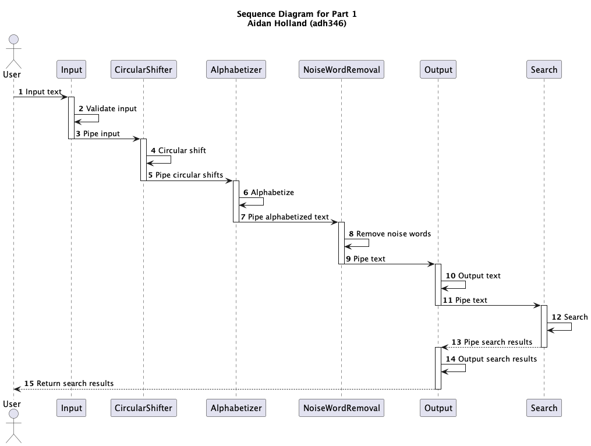

## SE 311 - Assignment 2 Part 1

Aidan Holland (adh346)

## Folder Structure

The workspace contains two folders by default, where:

- `src`: the folder to maintain sources
- `test`: the folder to maintain tests
- `bin`: the folder to maintain compiled output files
- `resources`: the folder to maintain resources

## How to Run

- Open the project in IntelliJ IDEA
- Open the `resources` folder and edit the `settings.properties` file
- Run the `Controller` class in the `src` folder
- The output will be in the project root folder

## How to Test

- Open the project in IntelliJ IDEA
- Run the `Test` configuration

## Sequence Diagram

